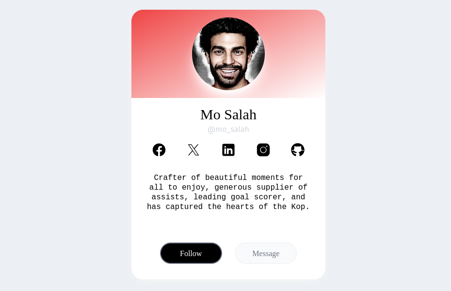

This is a project where I try out different UI challenges. Usually this involves building a single component based on something I've seen in a design. It's just a way that I can keep improving my skills in a fun way.

The project itself uses Astro and for most of the components I'm using React plus TailwindCSS. However, I sometimes just use Astro components with vanilla JS. And in future I might try to use Vue or Svelte.
